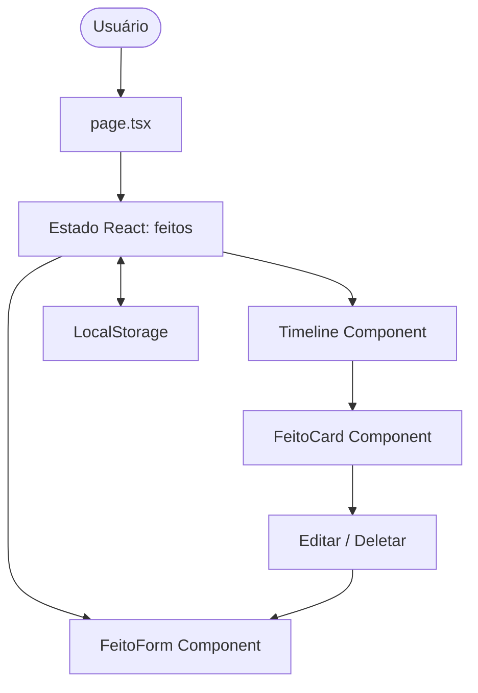

# Design do Core CRUD e Dashboard

**Especificação**: `.specs/features/core-crud/spec.md`
**Status**: Rascunho

---

## Visão Geral da Arquitetura

A aplicação será construída sobre o Next.js App Router (Single Page Application no cliente para a v1). Todo o estado de feitos (lista de conquistas/feedbacks) será mantido em um estado React (`useState`) no componente principal e sincronizado via efeitos (`useEffect`) com o `LocalStorage` do navegador.



---

## Análise de Reuso de Código

### Componentes Existentes para Alavancar

*Nenhum componente pré-existente (projeto novo).*

### Pontos de Integração

| Sistema | Método de Integração |
| :--- | :--- |
| LocalStorage | Armazenamento local usando a chave `autoelogio_feitos` em JSON. |

---

## Componentes

### 1. `Dashboard` (Componente Raiz / `page.tsx`)
- **Propósito**: Gerenciar o estado global de feitos, filtros e busca. Layout principal da tela.
- **Localização**: `src/app/page.tsx`
- **Interfaces**:
  - Estado: `feitos: Feito[]`, `filtroCategoria: string`, `busca: string`, `modalAberto: boolean`, `itemParaEditar: Feito | null`
- **Dependências**: React, LocalStorage, CSS Modules (`page.module.css`).

### 2. `Timeline`
- **Propósito**: Renderizar a listagem de feitos ordenada por data, desenhando a linha vertical do brag document.
- **Localização**: `src/app/components/Timeline.tsx`
- **Interfaces**:
  - Props: `feitos: Feito[]`, `onEdit: (f: Feito) => void`, `onDelete: (id: string) => void`
- **Dependências**: `FeitoCard`

### 3. `FeitoCard`
- **Propósito**: Exibir um registro individual de conquista ou feedback de forma atraente, usando cores e ícones correspondentes à categoria.
- **Localização**: `src/app/components/FeitoCard.tsx`
- **Interfaces**:
  - Props: `feito: Feito`, `onEdit: () => void`, `onDelete: () => void`
- **Dependências**: `lucide-react` para ícones.

### 4. `FeitoForm` (Formulário / Modal)
- **Propósito**: Capturar a inserção ou alteração de dados de forma intuitiva, adaptando os inputs se for categoria "feedback".
- **Localização**: `src/app/components/FeitoForm.tsx`
- **Interfaces**:
  - Props: `isOpen: boolean`, `onClose: () => void`, `onSave: (f: Omit<Feito, 'id' | 'createdAt'> & { id?: string }) => void`, `itemParaEditar: Feito | null`
- **Dependências**: React hooks (`useState`, `useEffect` para carregar valores editados).

### 5. `DeleteConfirm` (Modal de Confirmação)
- **Propósito**: Evitar exclusões acidentais com um modal elegante.
- **Localização**: `src/app/components/DeleteConfirm.tsx`
- **Interfaces**:
  - Props: `isOpen: boolean`, `onClose: () => void`, `onConfirm: () => void`, `itemTitle: string`

---

## Modelos de Dados

### `Feito` (Achievement / Feedback)

```typescript
export type Categoria = 'projeto' | 'feedback' | 'aprendizado' | 'certificacao' | 'outros';

export interface FeitoBase {
  id: string;
  titulo: string;
  descricao: string;
  categoria: Categoria;
  data: string; // Formato YYYY-MM-DD para ordenação correta
  linkReferencia?: string;
  createdAt: string; // ISO string
}

export interface Conquista extends FeitoBase {
  categoria: 'projeto' | 'aprendizado' | 'certificacao' | 'outros';
  impacto?: string; // Campo opcional de resultados mensuráveis
}

export interface Feedback extends FeitoBase {
  categoria: 'feedback';
  autor: string; // Nome de quem forneceu o feedback
  conteudo: string; // O depoimento na íntegra
}

export type Feito = Conquista | Feedback;
```

---

## Estratégia de Tratamento de Erros

| Cenário de Erro | Tratamento | Impacto no Usuário |
| :--- | :--- | :--- |
| LocalStorage Corrompido / JSON inválido | Bloco `try-catch` ao carregar dados; inicializa com array vazio `[]` e limpa chave quebrada. | O app não crasha e mostra o estado vazio padrão. |
| Formulário com campos inválidos (ex: sem título) | Validação nativa de HTML5 + validação simples em JS antes do envio. | Borda vermelha e tooltip indicando que o campo é obrigatório. |
| Link inválido fornecido | Validação de formato de URL se o campo não estiver em branco. | Aviso informando que o link deve começar com `http://` ou `https://`. |

---

## Decisões Técnicas

| Decisão | Escolha | Justificativa |
| :--- | :--- | :--- |
| Framework de Estilo | CSS Modules (`.module.css`) + Custom CSS Variables | Segue a diretriz de Vanilla CSS, garantindo isolamento de estilos por componente e alto controle de animações. |
| Tema por Padrão | Dark Mode Elegante | A estética premium fica wowed com dark themes (fundo Slate escuro, cards transparentes com efeito glassmorphism e sombras coloridas sutis). |
